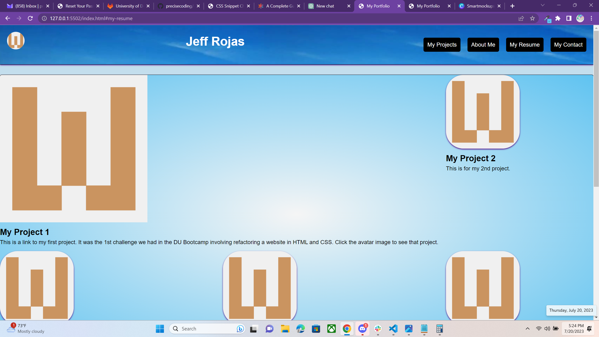

# challenge2
I built this website so employers and developers can access projects I have worked on and connect with me for possible employment and collaboration. They will find links to my projects, an about me section, a contact me section, and a link to my resume.

## User Story
AS AN employer
I WANT to view a potential employee's deployed portfolio of work samples
SO THAT I can review samples of their work and assess whether they're a good candidate for an open position

### Motivation
My motivation for completing this is to continue my education and build a page to display my projects, resume, etc... To interface with employers and developers.

### Why
I did this because I believe this is the best way to display my talent and connect with others.

#### Problem solving
This website solves many problems at once while allowing me a place to save and display my projects and personal information. Staying connected witht the community is importand and will allow me to continue moving forward in my coding carreer. 

##### What did you learn?
I learned how to structure and organize html and css files and connect them so they function and connect to the internet.

###### What makes your project stand out?
My project stands out beause it is unique to me and my personal work.

###### You can view a mock up below:

###### You can find a link to the project below.

Link to repo:
https://github.com/precisecoding/challenge2.git 

Link to deployed URL:
https://precisecoding.github.io/challenge2/ 
###### This site was built using github pages.
https://pages.github.com/

###### Thanks to everyone for your support and contributions!
Sources used, https://developer.mozilla.org/en-US/, https://www.w3schools.com/, https://stackoverflow.com/. Worked with a tutor, Cody Junier who was very helpful and lots of help from TA, George Yoo, he is absolutely amazing!